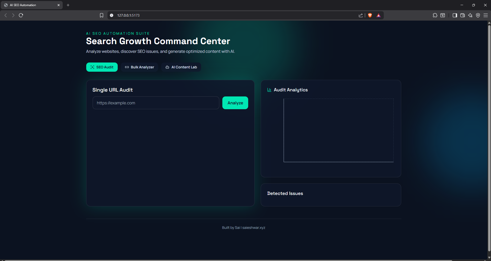
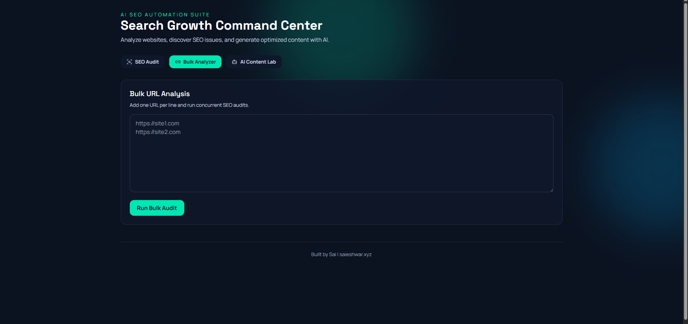

# AI SEO Automation

Production-style full-stack AI SEO platform built with FastAPI, React, Tailwind, and OpenAI APIs.

This system audits websites, scores SEO health, generates optimization suggestions, rewrites content with AI, creates keyword clusters and blog drafts, supports bulk URL analysis, and exports PDF reports.

!

## Screenshots





## Live Product Scope

- URL-based website scraping
  - Headings (`h1`-`h6`)
  - Paragraph text
  - Meta tags (title, description, keywords)
  - Images (`src`, `alt`)
  - Internal links
- SEO audit engine
  - Keyword density analysis
  - Meta tag quality checks
  - Heading structure validation
  - Internal linking evaluation
- Output intelligence
  - Composite SEO score
  - Category-wise score breakdown
  - Actionable issue list and fixes
- AI-powered content tooling
  - Humanized SEO content rewrite
  - Keyword generation (short-tail + long-tail)
  - Blog generation by topic and target keyword
- Automation and reporting
  - Bulk URL SEO analysis
  - PDF report export
- Premium dashboard experience
  - Dark-themed UI
  - Analytics visualization
  - Tab-based workflow for audit, bulk ops, and AI content lab

## Tech Stack

- Backend: `FastAPI`, `BeautifulSoup`, `Requests`, `Pydantic`, `ReportLab`
- Frontend: `React`, `Vite`, `Tailwind CSS`, `Recharts`, `Axios`
- AI: `OpenAI API`

## Folder Structure

```text
ai-seo-automation/
├─ backend/
│  ├─ app/
│  │  ├─ main.py
│  │  ├─ scraper.py
│  │  ├─ seo_audit.py
│  │  ├─ ai_service.py
│  │  ├─ report_service.py
│  │  ├─ models.py
│  │  └─ __init__.py
│  └─ requirements.txt
├─ frontend/
│  ├─ src/
│  │  ├─ App.jsx
│  │  ├─ main.jsx
│  │  └─ styles.css
│  ├─ package.json
│  ├─ tailwind.config.js
│  ├─ postcss.config.js
│  └─ vite.config.js
├─ .env.example
└─ README.md
```

## Quick Start

### 1. Backend

```bash
cd backend
py -3.13 -m venv .venv
.venv\Scripts\activate
pip install -r requirements.txt
set OPENAI_API_KEY=your_openai_api_key_here
uvicorn app.main:app --reload --host 127.0.0.1 --port 8000
```

### 2. Frontend

```bash
cd frontend
npm install
set VITE_API_BASE=http://127.0.0.1:8000
npm run dev -- --host 127.0.0.1 --port 5173
```

### 3. Open in Browser

- Frontend: `http://127.0.0.1:5173`
- Backend docs: `http://127.0.0.1:8000/docs`

## Environment Variables

Use `.env.example` as a reference:

```env
OPENAI_API_KEY=your_openai_api_key_here
OPENAI_MODEL=gpt-4.1-mini
VITE_API_BASE=http://127.0.0.1:8000
```

## API Endpoints

- `GET /health`
- `POST /api/analyze`
- `POST /api/bulk-analyze`
- `POST /api/rewrite`
- `POST /api/keywords`
- `POST /api/blog`
- `POST /api/export/pdf`

Detailed examples are in:

- `DOCUMENTATION.md`
- `docs/API.md`

## Dashboard Modules

- `SEO Audit`: Analyze single URL, view SEO score, chart, and issues.
- `Bulk Analyzer`: Analyze multiple URLs concurrently.
- `AI Content Lab`: Rewrite content, generate keywords, and generate blog posts.
- `PDF Export`: Download structured SEO report from audit data.

## Portfolio Summary

This project demonstrates:

- Practical AI integration in a real SaaS-style workflow.
- Full-stack system design with analytics-focused UX.
- Applied SEO engineering and scoring methodology.
- Automation features for agencies and growth teams.

Full portfolio write-up:

- `PORTFOLIO.md`

## Documentation Index

- [Project Documentation](./DOCUMENTATION.md)
- [API Reference](./docs/API.md)
- [Architecture Notes](./docs/ARCHITECTURE.md)
- [Deployment Guide](./docs/DEPLOYMENT.md)
- [Portfolio Case Study](./PORTFOLIO.md)

## Author Bio

**Sai (Saieshwar)** is an AI engineer and SEO strategist focused on building intelligent automation systems for organic growth, content operations, and data-driven marketing workflows.

- Website: [https://saieshwar.xyz](https://saieshwar.xyz)

## Credits

- Built by Sai | saieshwar.xyz
